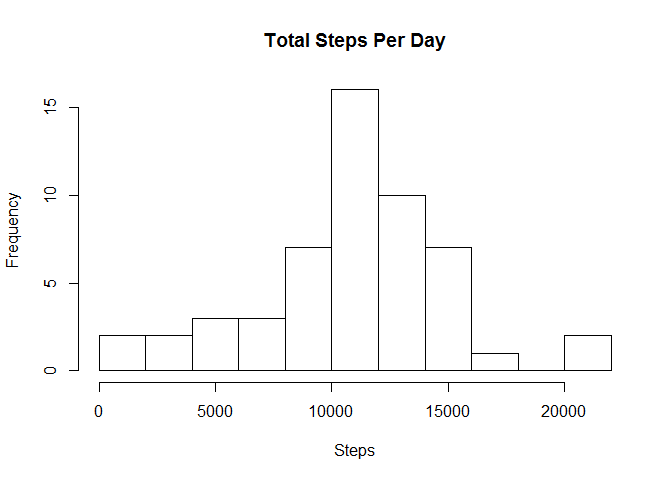
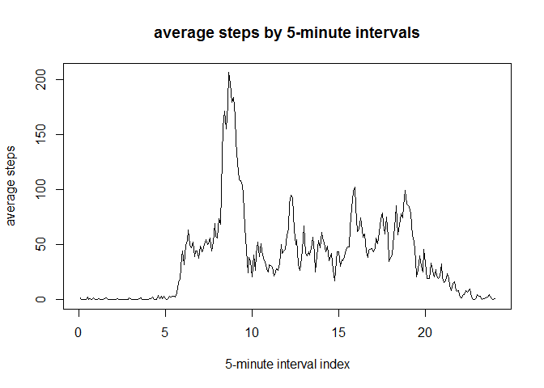
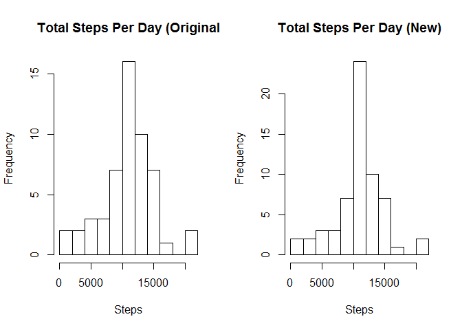
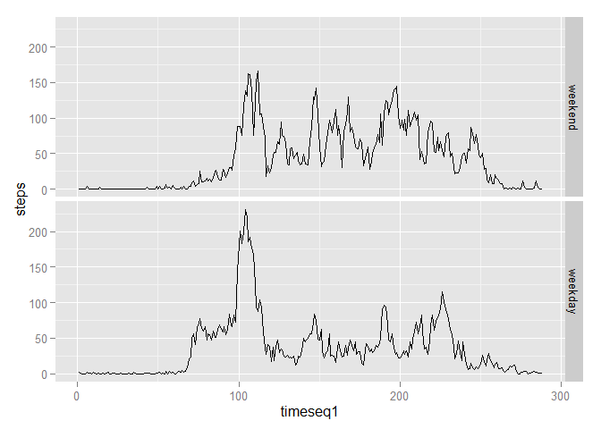

# Movement Pattern
Wang Bo  
Sep 10, 2015  

This document takes a close look at the data from a personal activity monitoring device. The data shows the steps made in every 5-minute interval. Based on this data, we find some results about the movement pattern during 2 months.

##Loading and preprocessing the data

```r
dataset=read.csv("activity.csv",header=T)  #load data and remove NA value
dataset1=dataset[!is.na(dataset$steps),]
```

##Mean total number of steps taken per day
In this part, I calculate the total number of steps taken per day, plot a histogram and report the mean and median of the total number of steps taken per day.

```r
library(reshape2)
#calculate total steps by day
datamelt=melt(dataset1,id=c("date","interval"),measure.vars="steps")
totalperday=dcast(datamelt,date~variable,sum)
#histogram plotting
hist(totalperday$steps,breaks=10,xlab="Steps",main="Total Steps Per Day")
```

 

```r
#mean and median
mm=c(mean(totalperday$steps),median(totalperday$steps))
names(mm)=c("mean","median")
print(mm)
```

```
##     mean   median 
## 10766.19 10765.00
```

The result shows the mean and the median are 10766.19 and 10765.00 respectively.

##The average daily activity pattern

In this part, I make a plot first to show the average steps made in every 5-minute intervals, and then find the maximum value.


```r
#calculate average steps by 5-minute intervals
averageperinterval=dcast(datamelt,interval~variable,mean)
#time sequence
timeseq=1:nrow(averageperinterval)
#make the plot
plot(timeseq,averageperinterval$steps,type="l",xlab="5-minute interval index",
     ylab="average steps",main="average steps by 5-minute intervals")
```

 

```r
#find the maximun value
x=averageperinterval[averageperinterval$steps==max(averageperinterval$steps),]
print(x)
```

```
##     interval    steps
## 104      835 206.1698
```

The result shows the maximum value of average steps is 206.1698, and the interval of 835 shows that this value is in the interval from 8:35 to 8:40.

##Missing values

In this part, I will fill the NA values to the dataset. I adopt the strategy that using the mean for that 5-minute interval. This is because there are some values missing in a whole day so using the mean/median for that day is impossible.


```r
#number of missing values
nanumber=nrow(dataset)-nrow(dataset1)
names(nanumber)="number of missing values"
print(nanumber)
```

```
## number of missing values 
##                     2304
```

```r
#fill values with the mean for that 5-minute interval
newdataset=dataset
for(i in 1:nrow(newdataset)){
  if(is.na(newdataset$steps[i])){
    newdataset$steps[i]=averageperinterval[averageperinterval$interval
                                           ==newdataset$interval[i],]$steps
  }
}
#make the same hisogram and calculate the same mean and median to see 
#if there is any difference after filling missing values
datamelt1=melt(newdataset,id=c("date","interval"),measure.vars="steps")
totalperday1=dcast(datamelt1,date~variable,sum)
par(mfrow=c(1,2))
hist(totalperday$steps,breaks=10,xlab="Steps",main="Total Steps Per Day (Original")
hist(totalperday1$steps,breaks=10,xlab="Steps",main="Total Steps Per Day (New)")
```

 

```r
mm=c(mean(totalperday$steps),median(totalperday$steps),
     mean(totalperday1$steps),median(totalperday1$steps))
names(mm)=c("mean original","median original","mean new","median new")
print(mm)
```

```
##   mean original median original        mean new      median new 
##        10766.19        10765.00        10766.19        10766.19
```

We can see there is no significant difference. This is possibly because I just replace the NAs with mean values so the mean is the same and the median is slightly different.

##Differences in activity patterns between weekdays and weekends

This part is to compare if there is any difference of movement pattern between weekdays and weekends. First I create a factor column to identify the date is weekday or weenend. And then I make the plot respectively. **Note: Since my operation system language is Chinese, I have to write the weekdays in Chinese. When you run the code, firstly you need to change it into English such as Saturday or Sat.**


```r
#create a factor column to identify if the date is weekend or not
newdataset$weekday=logical(nrow(newdataset))
newdataset$date=as.Date(newdataset$date)
newdataset$weekday=!weekdays(newdataset$date)%in%c("星期六","星期日") #Change it into Sat or whatever
newdataset$weekday=as.factor(newdataset$weekday)
levels(newdataset$weekday)=c("weekend","weekday")
#calculate average steps by 5-minute intervals
datamelt1=melt(newdataset,id=c("date","interval","weekday")
               ,measure.vars="steps")
averageperinterval1=dcast(datamelt1,interval+weekday~variable,mean)
#time sequence
timeseq1=1:(nrow(averageperinterval1)/2)
timeseq1=rep(timeseq1,each=2)
averageperinterval1=cbind(timeseq1,averageperinterval1)
#make the plot
library(ggplot2)
g=ggplot(averageperinterval1,aes(timeseq1,steps))
g=g+geom_line()
g=g+facet_grid(weekday~.)
g
```

 

We can see from the plot that on weekdays, there are more steps made around 8:30(100th interval or so) and less from 11:40(140th interval or so) to 17:00(200th interval or so).
